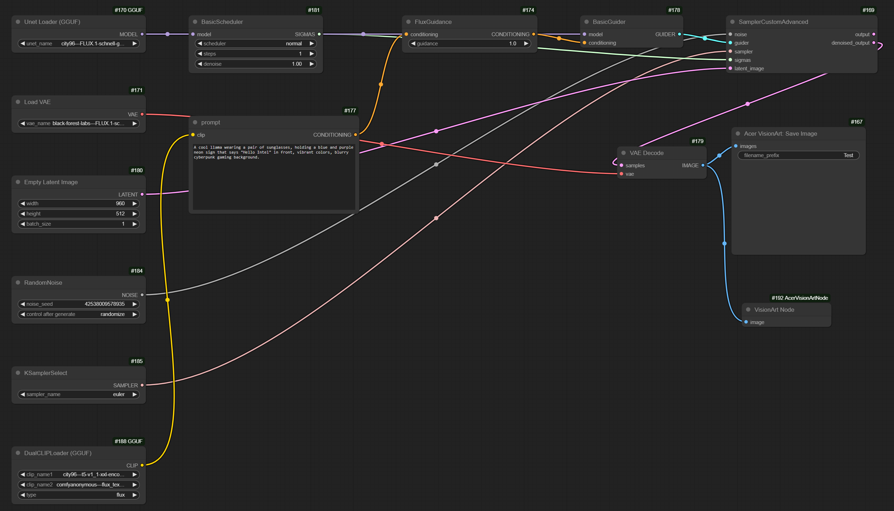

# VisionArt-AI Playground
AI PC starter app for doing AI 4K image createion on laptop.  
User can use AI Playground create image and use Acer VisionArt do outpaint and set to wallpaper.

# Outline
- VisionArt Workflow
- AI Playground Introduction
- VisionArt Interduction
- ComfyUI Introduction
- How to Execute VisionArt-AI Playground

# VisionArt Workflow 

VisionArt be a custom node in the workflow.

# AI Playground 
AI PC starter app for doing AI image creation, video creaion.

## Download the installer 
**AI Playground 2.5.5 Beta (all SKUs)** - [Release Notes](https://github.com/intel/AI-Playground/releases/tag/v2.5.5-beta) | [Download](https://github.com/intel/AI-Playground/releases/download/v2.5.5-beta/AI.Playground-2.5.5-beta.exe)

## Project Development 

## AI Playground Image Resolution 

Setting::
- Mode:: Default
- Image Resolution:: HD   
- Image Size

| Mega pixels | 12/5 | 16/9 | 3/2 | 4/3 | 1/1 | 3/4 | 2/3 | 9/6 | 5/12 |
| ------------ | ---- | ---- | ---- | ---- | ---- | ---- | ---- | ---- | ---- | 
| 0.25 | 768x320 | 704x384 | 576x384 | 576x448 | 512x512 | 448x576 | 448x640 | 384x704 | 320x832 |
| 0.5 | 1088x448 | 896x512 | 896x576 | 832x640 | 704x704 | 640x832 | 576x832 | 512x960 | 448x1088 |
| 0.8 | 1408x576 | 1152x640 | 1088x704 | 1024x768 | 896x896 | 768x1024 | 704x1088 | 704x1216 | 576x1408 |
| 1.0 | 1536x640 | 1344x768 | 1280x832 | 1216x896 | 1024x1024 | 896x1152 | 832x1280 | 768x1344 | 640x1536 |

## AI Playground Video Resolution 

Setting::
- Mode:: Workflow
- workflow:: Video:Img2Vid_0.9.6
- Image Size

| Mega pixels | 12/5 | 16/9 | 3/2 | 4/3 | 1/1 | 3/4 | 2/3 | 9/6 | 5/12 |
| ------------ | ---- | ---- | ---- | ---- | ---- | ---- | ---- | ---- | ---- | 
| 0.1 | 640x256 | 448x256 | 384x256 | 320x256 | 320x320 | 256x320 | 256x384 | 256x448 | 256x576 |
| 0.25 | 768x320 | 704x384 | 576x384 | 576x448 | 512x512 | 448x576 | 448x640 | 384x704 | 320x832 |
| 0.35 | 896x384 | 768x448 | 768x512 | 704x512 | 576x576 | 512x704 | 512x768 | 448x832 | 384x960 |
| 0.5 | 1088x448 | 896x512 | 896x576 | 832x640 | 704x704 | 640x832 | 576x832 | 512x960 | 448x1088 |

 

# VisionArt 
AI PC starter app for doing AI 4K image creation. VisionArt support Gen AI models includeing: 
- Image Diffusion: Dreamshpaer v7
- Outpainting: Stable diffusion v1.5 inpainting 
- Super Resolution: [WDSR](https://github.com/ychfan/wdsr)

> **NOTE**  
> outpainting image input resolution is **960x512**  

## VisionArt Download Link
- [VisionArt LNL](https://drive.google.com/file/d/1k3tDEinRkTk2C4syjMIiTqtttPc3pGIF/view?usp=drive_link)
- [VisionArt ARL](https://drive.google.com/file/d/1K96yo2LDLq8lr2EFKWOWEHyjGWyRbd5y/view?usp=drive_link )
 

## VisionArt Environment Setup
1. prepare Acer laptop
2. Install VisionArt 
3. Open file location
4. Download - [VisionArt AI Playground](https://drive.google.com/file/d/1LWoKHZME2E0bKOpMQUt7U3N1Y-8FpW_P/view?usp=sharing)
5. Replace **"AICO Out Paintint.exe"**
6. Reboot computer
 

## VisionArt Location
| Application | Path | 
| ------------ | ---- |
| AICO Out Painting | C:\Windows\System32\drivers\Acer\AICO 2.0\OutPaint\ |
| AICO 2 AC2S | C:\Windows\System32\drivers\Acer\AICO 2.0\OutPaint\ |
| AICO2_SVC | C:\Windows\System32\drivers\Acer\AICO 2.0\ |
| AICO2 Log | C:\ProgramData\Acer\AICO\logs\ |
| AICO2 Cache | %localappdata%\Acer\AICO2\caching\ |

## VisionArt Version Check
**Registry key**
- Computer\HKEY_LOCAL_MACHINE\SOFTWARE\Acer\AICO2\
 

| Name | Description | 
| ------------ | ---- |
| AICO2Installer | VisionArt driver installer |
| AICO2SVC | VisionArt background service |
| AICO2AC2S | VisionArt communication center |
| AICO2OutPaint | VisionArt out paint |
 

# ComfyUI
## Server
- IP: localhost:49000  

## Environment
- Intel AI Playground 2.5B Replace File  

| File | Source | Destination | Description | 
| ---- | ----------- | ---------------- | ----------- |
| AcerVisionArtNode.py | ..\resource\ComfyUI\custom_nodes\ | ..\AI Playground\resources\ComfyUI\custom_nodes\ | Add custom nodes | 
| AcerVisionArt_fluxQ4.json | ..\resource\workflow\ | ..\AI Playground\resources\workflows\ | Intel AI Playground workflow |
| AcerVisionArt_ComfyUI_fluxQ4.json | ..\resource\workflow\ | ..\AI Playground\resources\workflows\ | ComfyUI workflow |

# How to Execute VisionArt-AI Playground
1. Open Setting->Image
2. Mode switch to "Workflow"
3. Select "Acer Flux.1-Schnell Med Quality"
4. Resolution: **896 x 512**
5. Steps: 4
6. Generate Image Number: 1
7. Input prompts and Generate.

> **NOTE**  
> - Inference time: 40 ~ 50 secs (Model: Flux.1-Schnell Med Quality)  
> - Inference device: GPU  
> - Memory Usage: 8~9 GBs   