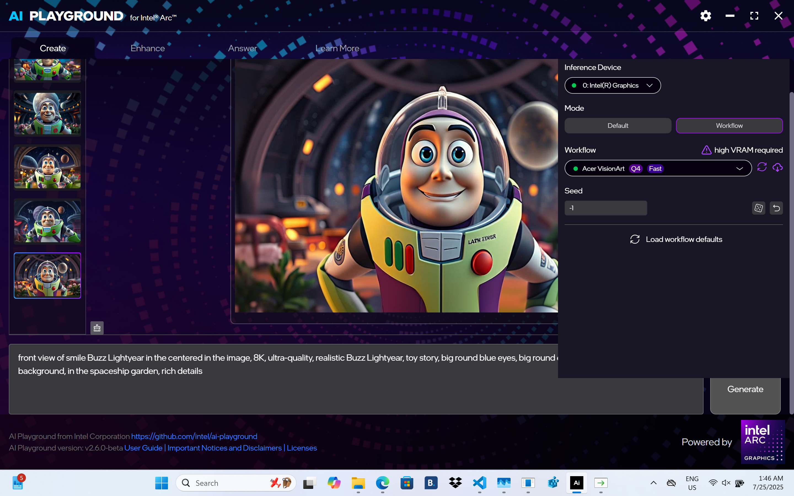
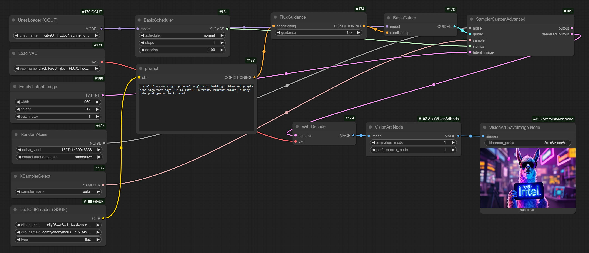
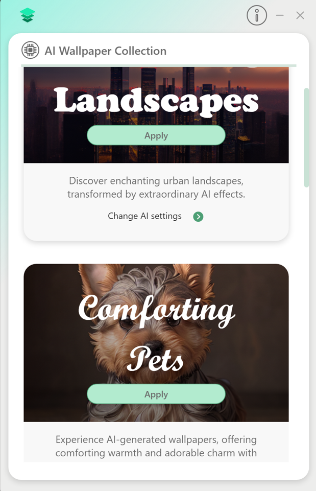

# VisionArt-AI Playground
AI PC starter app for doing AI 4K image createion on laptop.  
User can use AI Playground create image and use Acer VisionArt do upscaling and place generated image.

<!-- TABLE OF CONTENTS -->

  
Outline

  <ol>
    <li>
      <a href="#ai-playground">AI Playground</a>
      <ul>
        <li><a href="#download-the-installer">Downdload the installer</a></li>
        <li><a href="#version-v260b-feature">Version v2.6.0b Feature</a></li>
        <li><a href="#aipg-visionart-workflow">AIPG-VisionArt Workflow </a></li>
      </ul>
    </li>
    <li>
      <a href="#visionart">VisionArt</a>
      <ul>
        <li><a href="#visionart-download-link">VisionArt Download Link</a></li>
        <li><a href="#version-v203014-feature ">Version v2.0.3014 Feature </a></li>        
      </ul>
    </li>
  </ol>

# AI Playground 
AI PC starter app for doing AI image creation, video creaion.

 
(<a href="#readme-top">back to top</a>)

## Download the installer 
**AI Playground 2.6.0 Beta (all SKUs)** - [Release Notes](https://github.com/intel/AI-Playground/releases/tag/v2.6.0-beta) | [Download](https://github.com/intel/AI-Playground/releases/download/v2.6.0-beta/AI.Playground-2.6.0-beta.exe) | [Github](https://github.com/intel/AI-Playground)
 
(<a href="#readme-top">back to top</a>)

## Version v2.6.0b Feature 
- Acer VisionArt workflow added for upscaling and placing generated images on your desktop (Acer AI PC required).
 
(<a href="#readme-top">back to top</a>)

# AIPG-VisionArt Workflow 

VisionArt be a custom node in the workflow.

(<a href="#readme-top">back to top</a>)

# VisionArt 
AI PC starter app for doing AI 4K image creation. VisionArt support Gen AI models upscaling and placing generated images.  
  

 

(<a href="#readme-top">back to top</a>)

## Version v2.0.3014 Feature 
- Support AI Playground:Acer VisionArt workflow.
 
(<a href="#readme-top">back to top</a>)

## Manual Update Script
1. Download [AcerPartner VisionArt Last Tag](https://github.com/AcerPartner/VisionArt.git)
2. Open document "C:\Users\Your PC ID\AppData\Local\Programs\AI Playground\resources\ComfyUI\custom_nodes\VisionArt"
3. Replace "VisionArt"
4. Relaunch AI Playground. 
