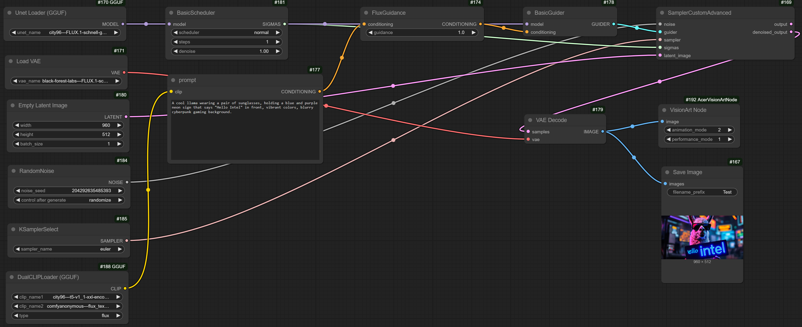

# VisionArt-AI Playground
AI PC starter app for doing AI 4K image createion on laptop.  
User can use AI Playground create image and use Acer VisionArt do outpaint and set to wallpaper.

# VisionArt Workflow 

VisionArt be a custom node in the workflow.

# Download the installer 
**AI Playground 2.5.5 Beta (all SKUs)** - [Release Notes](https://github.com/intel/AI-Playground/releases/tag/v2.5.5-beta) | [Download](https://github.com/intel/AI-Playground/releases/download/v2.5.5-beta/AI.Playground-2.5.5-beta.exe)

# Project Development 

# VisionArt 

## VisionArt Download Link
- [VisionArt LNL](https://drive.google.com/file/d/1k3tDEinRkTk2C4syjMIiTqtttPc3pGIF/view?usp=drive_link)
- [VisionArt ARL](https://drive.google.com/file/d/1K96yo2LDLq8lr2EFKWOWEHyjGWyRbd5y/view?usp=drive_link )
 

## VisionArt Environment Setup
1. Install VisionArt 
2. Open file location
3. Download - [VisionArt AI Playground](https://drive.google.com/file/d/1LWoKHZME2E0bKOpMQUt7U3N1Y-8FpW_P/view?usp=sharing)
4. Replace **"AICO Out Paintint.exe"**
5. Reboot computer
 

## VisionArt Location
| Application | Path | 
| ------------ | ---- |
| AICO Out Painting | C:\Windows\System32\drivers\Acer\AICO 2.0\OutPaint\ |
| AICO 2 AC2S | C:\Windows\System32\drivers\Acer\AICO 2.0\OutPaint\ |
| AICO2_SVC | C:\Windows\System32\drivers\Acer\AICO 2.0\ |
| AICO2 Log | C:\ProgramData\Acer\AICO\logs\ |
| AICO2 Cache | %localappdata%\Acer\AICO2\caching\ |

## VisionArt Version 
**Registry key**
- Computer\HKEY_LOCAL_MACHINE\SOFTWARE\Acer\AICO2\
 

| Name | Description | 
| ------------ | ---- |
| AICO2Installer | VisionArt driver installer |
| AICO2SVC | VisionArt background service |
| AICO2AC2S | VisionArt communication center |
| AICO2OutPaint | VisionArt out paint |
 

# Execute
- Open Setting->Image
- Mode switch to "Workflow"
- Resolution: 896 x 512
- Steps: 4
- Input prompts and Generate.

PS: Inference time: 40 ~ 50 secs (Model: Flux.1-Schnell Med Quality)  
PS: Inference device: GPU  
PS: Memory Usage: 8~9 GBs  

# ComfyUI
## Server
- IP: localhost:49000  

## Environment
- Intel AI Playground 2.5B Replace File  

| File | Source | Destination | Description | 
| ---- | ----------- | ---------------- | ----------- |
| AcerVisionArtNode.py | ..\resource\ComfyUI\custom_nodes\ | ..\AI Playground\resources\ComfyUI\custom_nodes\ | Add custom nodes | 
| AcerVisionArt_fluxQ4.json | ..\resource\workflow\ | ..\AI Playground\resources\workflows\ | Intel AI Playground workflow |
| AcerVisionArt_ComfyUI_fluxQ4.json | ..\resource\workflow\ | ..\AI Playground\resources\workflows\ | ComfyUI workflow |

